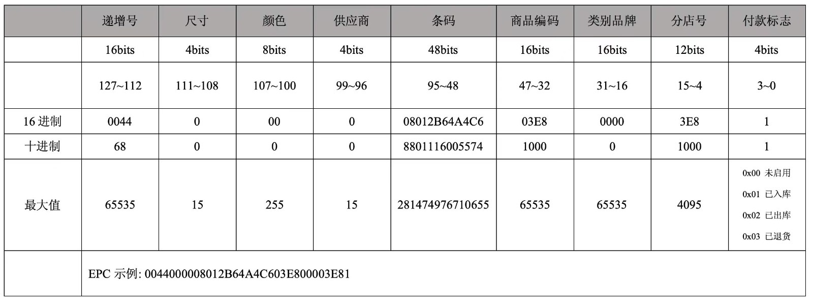

# gun_rfid

## Getting Started

## RFID 图文



## RFID 運行效果圖

  
_運行效果圖_

### 申明插件

```dart
import 'package:gun_rfid/gun_rfid.dart';
final _gunRfidPlugin = GunRfid();
```

### 初始化 RFID

```dart
await _gunRfidPlugin.initRFID();
```

### 关闭 RFID

```dart
await _gunRfidPlugin.closeRFID();
```

### 获取 RFID 连接状态

```dart
await _gunRfidPlugin.getConnectState();
```

### 获取读取模式

```dart
await _gunRfidPlugin.getReadState();
```

### 注册手柄按键

```dart
await _gunRfidPlugin.registerKey();
```

### 注销手柄按键

```dart
await _gunRfidPlugin.unregisterKey();
```

### DART 按钮盤點

```dart
await _gunRfidPlugin.startInventory();
```

### 設備手柄按钮盤點

```dart
 /**
 * 手柄按钮盤點,需要在initState獲取數據
 *會自動監測當前盤點狀態進行停止或開始
 */
 void initState() {
    getKeyData();
  }

  Future<void> getKeyData() async {
    _gunRfidPlugin.keyStartInventory((value) {
      debugPrint("手柄按鈕盤點: $value");
    });
  }
```

### DART 按钮停止盘点

```dart
await _gunRfidPlugin.stopInventory();
```

### 重启 RFID 模块

```dart
await _gunRfidPlugin.restartRFID();
```

### 设置过滤

```dart
/**
 * 设置过滤
 * @param {string} filter。
 */
await _gunRfidPlugin.setFilter("filter string");
```

### 设置功率

```dart
/**
 * 设置功率
 * @param {number} power - 功率，可选值为 5~33。
 */
await await _gunRfidPlugin.setPower(int power);
```

### 修改或写入 EPC

```dart
/**
 * 修改或写入 EPC
 * @param {String} oldEPC - string 类型，旧的 EPC 值。
 * @param {String} newEPC - string 类型，新的 EPC 值。
 *成功后必须重启 RFID 模块
 */
bool ret = await _gunRfidPlugin.editEPC(oldEPC, newEPC);

```

### 重启 RFID

```dart
bool ret =  await _gunRfidPlugin.restartRFID();
```
